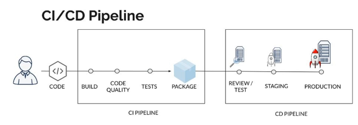
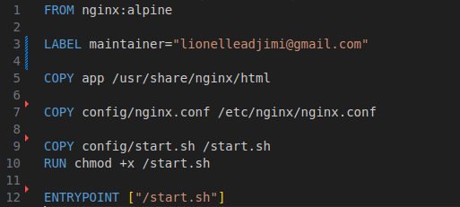
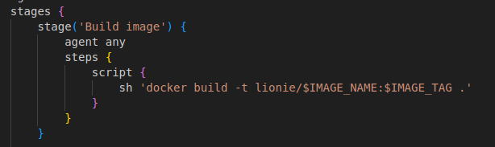
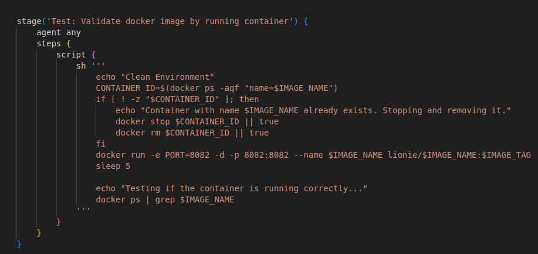
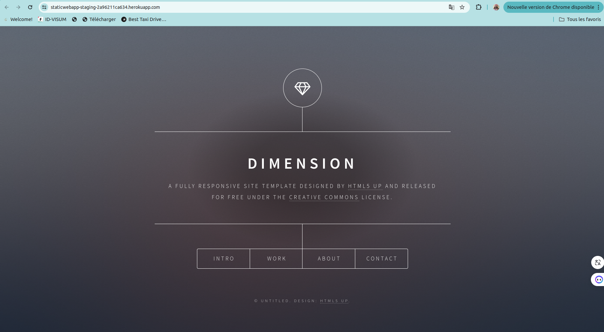
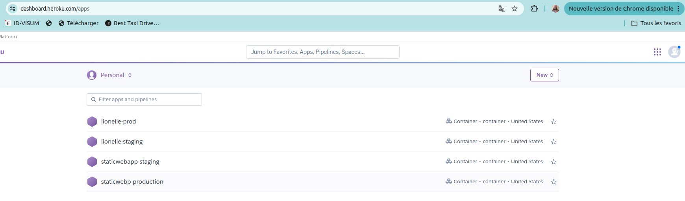

# Mini projet gitlab-CI/CD :Static Website Example

## Owner

Prénom : Lionelle

Nom: ADJIMI ADAMOU

Pour le 20e Bootcamp DevOps d'Eazytraining

Période : juillet à septembre 2024

Début: Lundi 29 juillet 2024

LinkedIn : https://www.linkedin.com/in/lionelle-adjimi-adamou-01a782217/

## Application 

Mettre en place un pipeline avec jenkins.

Notre pipeline comprend deux grandes parties à savoir:
- le CI pipeline qui effectue l'intégration continue de notre pipeline
- le CD pipeline qui effectue le déploiement continu de notre pipeline

Avant de passer à la configuration de notre pipeline, nous allons d'abord créer le fichier Dockerfile, qui contiendra les instructions nécessaires pour construire notre image Docker.

## I- CI pipeline
Cette partie est contituée des étapes suivantes:

- build image;
- Test: Validate docker image by running container;
- Cleanup docker container.

### I-1 Build image
Cette étape permet de construir l'image docker pour l'application.

### I-2 Test: Test: Validate docker image by running container;
Cette étape  permet de lancer un conteneur à partir de l'image construite pour valider son bon fonctionnement.

### I-3 Cleanup docker container
Cette étape permet d'arrêter et supprimer le conteneur après les tests.

## II- CD pipeline
Cette partie est constituée des étapes suivantes:

- Deploy to staging on heroku 
- Deploy to production on heroku

### II-1 Deploy to staging on heroku 
L'étape de staging permet de pousser l'image Docker sur Heroku et la déployer sur l'environnement de staging.

  

 ### II-2 Deploy to production on heroku
 L'étape de staging permet de pousser l'image Docker sur Heroku et la déployer sur l'environnement de staging.

  ------------

  ## Ceci conclut mon rapport d’exécution du mini-projet Jenkins. 

Ce projet a permis d'acquérir des compétences en automatisation et optimisation des processus de développement avec Jenkins, assurant la qualité et la rapidité des déploiements.

